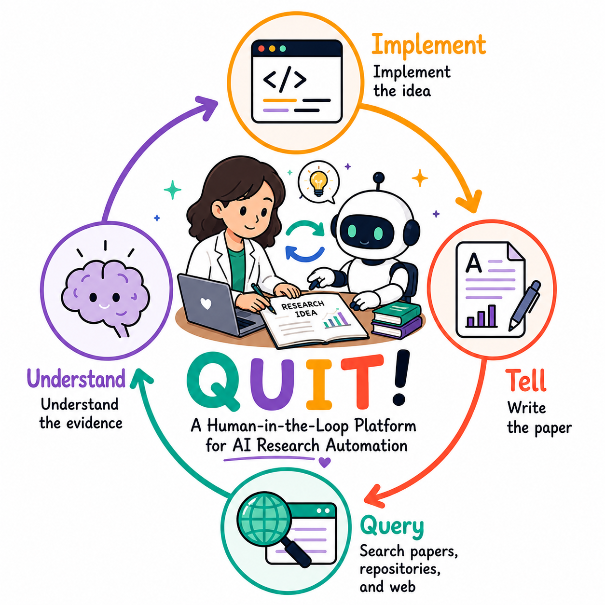
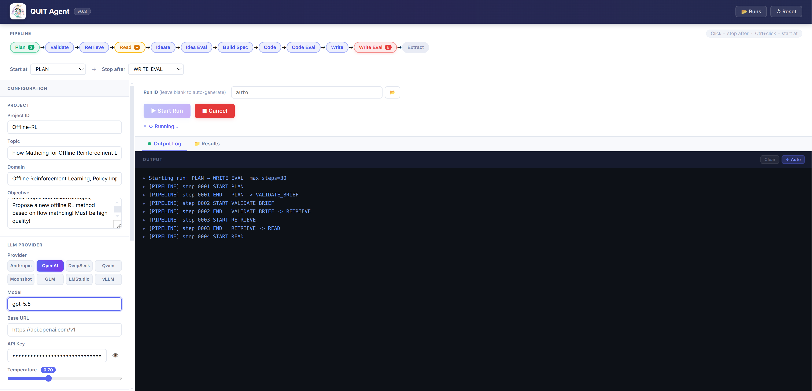

<p align="center">
  
</p>

<p align="center">
  <strong style="font-size:1.4em;">QUIT Agent — Web UI User Guide</strong><br/>
  <em>A step-by-step walkthrough for running your first research pipeline</em>
</p>

---

## 📋 Table of Contents

1. [Launch the Server](#1-launch-the-server)
2. [Interface Overview](#2-interface-overview)
3. [Step 1 — Configure Your Project](#3-step-1--configure-your-project)
4. [Step 2 — Set Up Your LLM Provider](#4-step-2--set-up-your-llm-provider)
5. [Step 3 — Choose Pipeline Range](#5-step-3--choose-pipeline-range)
6. [Step 4 — Start a Run](#6-step-4--start-a-run)
7. [Step 5 — Monitor Progress](#7-step-5--monitor-progress)
8. [Human-in-the-Loop Interventions](#8-human-in-the-loop-interventions)
9. [Browsing Past Runs](#9-browsing-past-runs)

---

## 1. Launch the Server

```bash
source .venv/bin/activate
cd Quit_v0_3_web
python server.py --port 7862
```

Then open **http://localhost:7862** in your browser. You should see the QUIT Agent interface.

---

## 2. Interface Overview

<p align="center">
  
</p>

The interface is divided into three main areas:

| Area | Location | Purpose |
|---|---|---|
| 🗂️ **Pipeline bar** | Top | Shows all workflow states; click to set stop/start points |
| ⚙️ **Configuration panel** | Left | Set project details and LLM credentials |
| 🖥️ **Run panel** | Center/Right | Launch runs, view live output, browse results |

---

## 3. Step 1 — Configure Your Project

In the left **CONFIGURATION** panel, fill in the **PROJECT** section:

- 📁 **Project ID** — a short name for this research project (e.g. `offline-rl`). Leave blank to auto-generate.
- 🔖 **Topic** — the research question or theme (e.g. `flow matching for offline reinforcement learning`).
- 🏷️ **Domain** — the research domain (e.g. `Offline Reinforcement Learning, Policy Improvement`).
- 📝 **Objective** — a short description of what you want the agent to achieve. Be specific — this shapes the entire pipeline.

> 💡 **Tip:** A well-written Objective (2–3 sentences on the research gap and desired contribution) leads to significantly better ideas and code.

---

## 4. Step 2 — Set Up Your LLM Provider

In the **LLM PROVIDER** section of the left panel:

1. 🔘 **Click your provider** — choose from `Anthropic`, `OpenAI`, `DeepSeek`, `Qwen`, `Moonshot`, `GLM`, `LMStudio`, or `vLLM`.
2. 🤖 **Model** — enter the model name (e.g. `gpt-5.5`, `deepseek-v4-pro`).
3. 🌐 **Base URL** — pre-filled for major providers; change only for custom endpoints.
4. 🔑 **API Key** — paste your API key. It is stored only in the browser session and never logged.
5. 🌡️ **Temperature** — controls creativity (default `0.70`). Lower = more focused; higher = more exploratory.

> 🔒 To avoid re-entering your API key each time, copy `.env.example` to `Quit_v0_3/.env` and fill in your key. The agent loads this file automatically on startup.

---

## 5. Step 3 — Choose Pipeline Range

<p align="center">

```
Plan → Validate → Retrieve → Read → Ideate → Idea Eval → Build Spec → Code → Code Eval → Write → Write Eval → Extract
```

</p>

The **pipeline bar** at the top shows all workflow states in order.

- 🖱️ **Click a state** in the bar → sets it as the **Stop after** point (the run will pause there)
- ⌨️ **Ctrl + click a state** → sets it as the **Start at** point (resume from that state)
- You can also use the **Start at** and **Stop after** dropdowns below the pipeline bar for precise control

**Common presets:**

| Goal | Start at | Stop after |
|---|---|---|
| Full pipeline | `PLAN` | `WRITE_EVAL` |
| Literature review only | `PLAN` | `READ` |
| Generate ideas, skip writing | `PLAN` | `IDEA_EVAL` |
| Re-run writing from existing results | `WRITE` | `WRITE_EVAL` |

---

## 6. Step 4 — Start a Run

1. *(Optional)* Enter a **Run ID** — leave blank to auto-generate a timestamped ID.
2. ✅ Double-check your Topic, Provider, and pipeline range.
3. 🟢 Click **Start Run**.

The button turns grey and a **Running…** indicator appears. The agent is now executing the pipeline.

> ⏹️ To stop at any time, click **Cancel**. All artifacts written so far are preserved and the run can be resumed later.

---

## 7. Step 5 — Monitor Progress

The **Output** panel on the right shows a live log of state transitions:

```
▸ Starting run: PLAN → WRITE_EVAL  max_steps=30
▸ [PIPELINE] step 0001 START  PLAN
▸ [PIPELINE] step 0001 END    PLAN  →  VALIDATE_BRIEF
▸ [PIPELINE] step 0002 START  VALIDATE_BRIEF
...
```

Switch between tabs to see more detail:

- 📋 **Output Log** — full pipeline trace with state transitions and agent messages
- 📊 **Results** — final metrics, tables, and links to the generated paper once the run completes

---

## 8. Human-in-the-Loop Interventions

All pipeline outputs are plain files under `Quit_v0_3/runs/<run_id>/`. You can intervene at any point:

| Action | How | When to use |
|---|---|---|
| 👁️ **Inspect** | Open any artifact file in your editor | Check evidence cards, ideas, or the BuildSpec before proceeding |
| ✏️ **Edit** | Modify an artifact file directly | Steer the direction — e.g. rewrite the BuildSpec to change the experiment design |
| ⏸️ **Stop** | Click **Cancel**, or set a **Stop after** state | Pause before a slow or expensive stage |
| ▶️ **Resume** | Set **Start at** to the next state, click **Start Run** | Continue after reviewing or editing artifacts |
| 🔁 **Rerun a state** | Set **Start at = Stop after = <state>**, click **Start Run** | Re-execute a single state after fixing its input |

> 🙋 **Example workflow:** run until `IDEA_EVAL`, read `IdeaLibrary.jsonl`, delete weak ideas, edit the best one, then resume from `BUILD_SPEC`.

---

## 9. Browsing & Resuming Past Runs

Click **Runs** in the top-right corner to open the run history panel. Every past run is listed with:

- 🗂️ Its **Run ID** and timestamp
- 📄 All **artifacts** (evidence cards, BuildSpec, code, results, paper)
- 💬 Full **prompts and LLM responses** under `llm/` for reproducibility

Runs are stored under `Quit_v0_3/runs/<run_id>/` and can be inspected or restarted at any time.

**▶️ Resuming a past run from the middle:**

You can re-enter any previous run at any state — all existing artifacts are preserved and reused:

1. 📋 Copy the **Run ID** from the Runs panel (or from the folder name under `runs/`)
2. 🔢 Paste it into the **Run ID** field in the main panel
3. ⌨️ Set **Start at** to the state you want to resume from (e.g. `WRITE`)
4. 🖱️ Set **Stop after** to your desired end state
5. 🟢 Click **Start Run** — the agent picks up from that state using the artifacts already on disk

> 💡 **Example:** a run that finished `CODE_EVAL` but never reached `WRITE` can be resumed by entering its Run ID, setting `Start at = WRITE`, and clicking **Start Run** — no recomputation of earlier stages.

---

<p align="center">
  <sub>Back to <a href="README.md">README</a></sub>
</p>
