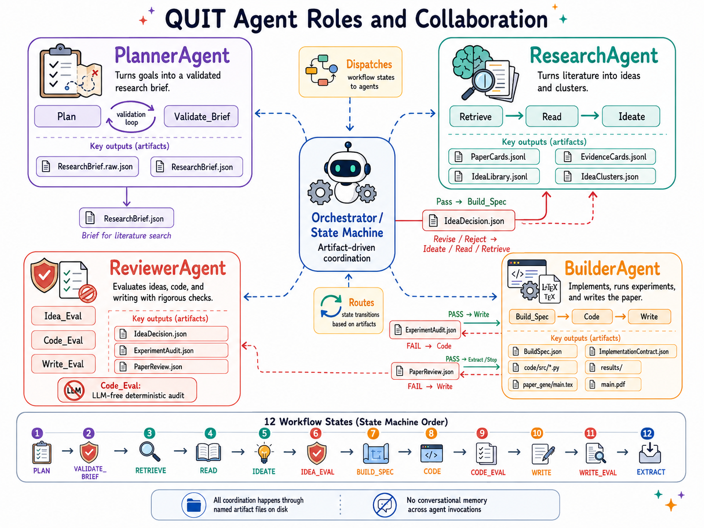
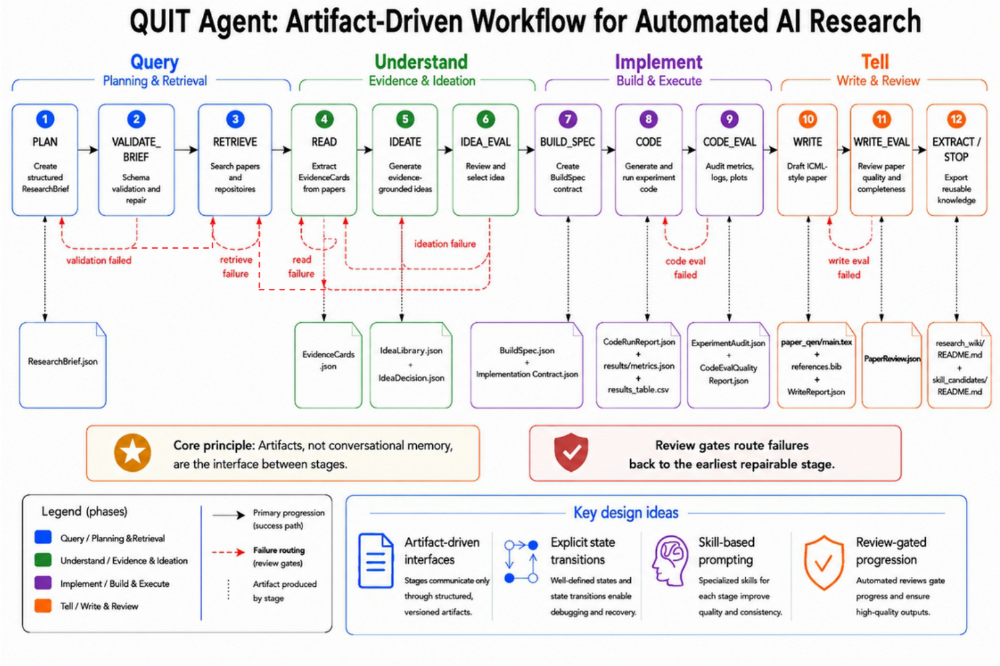
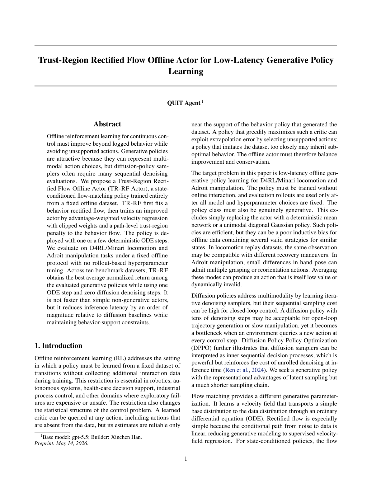
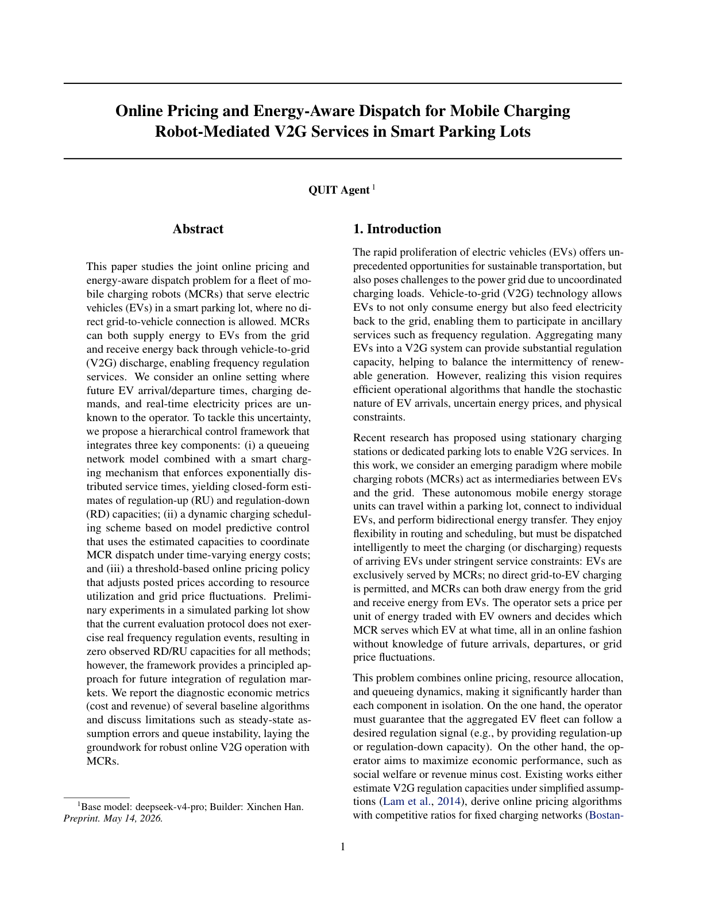
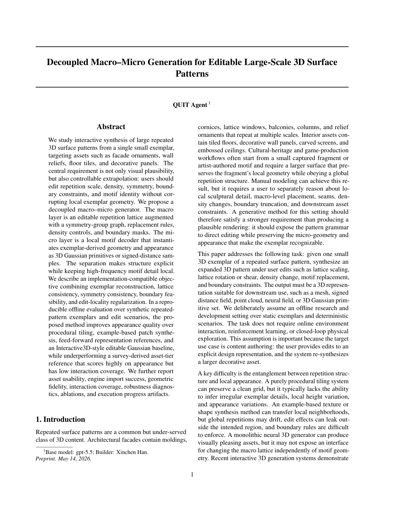

<p align="center">
  
</p>

<p align="center">
  <strong style="font-size:1.6em;">QUIT: A Human-in-the-Loop Platform for AI Research Automation</strong><br/>
  <strong><em>Query &nbsp;·&nbsp; Understand &nbsp;·&nbsp; Implement &nbsp;·&nbsp; Tell</em></strong><br/>
  <sub>✦ &nbsp; Quit the Old Way of Doing Research &nbsp; ✦</sub>
</p>

<p align="center">
  
  
</p>

---

QUIT is a human-in-the-loop research assistant — not a black box, but a transparent pipeline where researchers remain in full control at every step.
Its **artifact-driven design** eliminates long-context dependency and avoids redundant token consumption.

End-to-end cost with DeepSeek-V4-Pro: roughly **¥10 ($1.5) per manuscript**.

| Stage | What it does |
|:---:|---|
| 🔍 **Query** | Search papers, repositories, and local literature |
| 💡 **Understand** | Extract evidence cards, cluster insights, generate ideas |
| 🔧 **Implement** | Convert the selected idea into code, run experiments, audit results |
| 📝 **Tell** | Draft and review paper from actual outputs |

---

## 🏗️ System Architecture

<p align="center">
  
</p>

Four specialized agents are coordinated by a central **Orchestrator / State Machine**:

- 🗺️ **PlannerAgent** — turns the user's topic into a validated `ResearchBrief`
- 🔬 **ResearchAgent** — retrieves papers, extracts evidence, and synthesizes ideas
- 🏗️ **BuilderAgent** — generates experiment code, runs it, and writes the paper
- 🔍 **ReviewerAgent** — audits ideas, code quality, and the paper draft

All coordination happens through named artifact files on disk — no agent shares conversational memory across invocations. This makes the entire pipeline **traceable, reproducible, and resumable**.

> 🙋 **Human-in-the-Loop control points:** researchers can stop after any state to inspect artifacts, edit intermediate files (evidence cards, BuildSpec, generated code, results), and resume from a chosen state.

---

## 🔄 Workflow

<p align="center">
  
</p>

---

## ⚙️ Installation

**Requirements:** Python 3.11+, Git, LaTeX (`texlive` + `latexmk`)

```bash
git clone https://github.com/Mr-XcHan/QUIT.git
cd QUIT
bash setup.sh
```

The script creates a `.venv` at the repo root and installs the agent and web UI. For local LLM inference (torch + transformers):

```bash
bash setup.sh --with-local
```

Missing system tools (`latexmk`, `bibtex`) are reported with install hints at the end of setup.

---

## 🛠️ Configuration

The main config file is `Quit_v0_3/config.json`. **Default parameters are ready to use** — the only fields you typically need to set are your research topic and LLM credentials. All parameters in this file serve as defaults and can also be overridden directly in the Web UI before each run.

```json
{
  "project": {
    "topic": "Flow Matching for Offline Reinforcement Learning"
  },
  "llm": {
    "provider": "openai",
    "model": "gpt-5.5",
    "api_key_env": "OPENAI_API_KEY"
  }
}
```

Store your API key in a `.env` file next to `config.json` (never commit it):

```
OPENAI_API_KEY=sk-...
```

Supported providers: `anthropic`, `openai`, `deepseek`, `local-vllm`, and other OpenAI-compatible endpoints.

<details>
<summary>⚙️ Other settings you may want to adjust</summary>

| Field | Default | Description |
|---|---|---|
| `runtime.stop_after` | `null` | Stop after a specific state (e.g. `"CODE_EVAL"`) |
| `run_budget.experiment_timeout_seconds` | `3600` | Max time for generated experiments |
| `retrieval.sources` | `["arxiv"]` | Paper search sources |
| `write.expected_main_pages` | `8` | Target paper length |

</details>

---

## 🖥️ Usage — Web UI (Recommended)

<p align="center">
  
</p>

Activate the environment and start the server:

```bash
source .venv/bin/activate
cd Quit_v0_3_web
python server.py --port 7862
```

Then open **http://localhost:7862** in your browser.

**▶️ Quick start:** fill in your research topic, click **Start Run**, and the agent runs through all workflow states automatically until the **Stop after** state. For a detailed step-by-step walkthrough, see [GUIDE.md](GUIDE.md).

**🙋 Human-in-the-loop intervention:** because all outputs are files, you can at any point:

- 👁️ **Inspect** artifacts (evidence cards, BuildSpec, code, results, paper) from the **Artifacts** panel
- ⏹️ **Stop** at any state, review outputs, then continue
- ✏️ **Edit** intermediate files and **resume** from a chosen state — without rerunning earlier stages
- 🔁 **Rerun** a specific state after corrections (e.g. edit the BuildSpec, then rerun `CODE`)

**📂 Browsing past runs:** all runs are saved under `Quit_v0_3/runs/<run_id>/`. The **Runs** panel lists every past run with its full artifact trail, prompts, and LLM responses.

---

## 📦 Key Artifacts

Each run produces a complete artifact trail under `runs/<run_id>/`:

```
ResearchBrief.json          ← validated research plan
EvidenceCards.jsonl         ← structured paper evidence
IdeaLibrary.jsonl           ← candidate ideas with evidence links
BuildSpec.json              ← experiment + paper contract
code/src/*.py               ← generated experiment code
results/metrics.json        ← experiment results
results/results_table.csv   ← per-method comparison table
CodePerformanceEval.json    ← LLM verdict on method vs. baselines
paper_gene/main.tex         ← generated LaTeX paper
paper_gene/main.pdf         ← compiled paper
run_trace.json              ← full state transition log
```

All prompts and raw LLM responses are saved under `llm/` for full reproducibility.

---

## 📄 Generated Paper Showcase

Papers produced end-to-end by QUIT Agent across different research domains:

<table width="100%">
  <tr>
    <td align="center" valign="top" width="33%" style="padding:12px">
      <a href="Demos/offline_rl_rectified_flow.pdf">
        
      </a>
      <br/><br/>
      <b>Offline RL</b><br/>
      <sub><em>Trust-Region Rectified Flow Offline Actor for Low-Latency Generative Policy Learning</em></sub>
    </td>
    <td align="center" valign="top" width="33%" style="padding:12px">
      <a href="Demos/robot_v2g_dispatch.pdf">
        
      </a>
      <br/><br/>
      <b>Robot</b><br/>
      <sub><em>Online Pricing and Energy-Aware Dispatch for Mobile Charging Robot-Mediated V2G Services</em></sub>
    </td>
    <td align="center" valign="top" width="33%" style="padding:12px">
      <a href="Demos/3d_pattern_synthesis.pdf">
        
      </a>
      <br/><br/>
      <b>3D Generation</b><br/>
      <sub><em>Decoupled Macro–Micro Generation for Editable Large-Scale 3D Surface Patterns</em></sub>
    </td>
  </tr>
</table>

---

**We're looking for testers!** 🚀 Try the pipeline with your own research idea and see how far it gets.
Full auto-run results are welcome, but we're especially excited to feature **human-in-the-loop works** — papers where researchers stepped in to guide the agent, edit intermediate artifacts, or steer the direction. Those tend to be the most interesting results.

If you'd like your output showcased here, feel free to open an issue or pull request. 🙌

---

## 📬 Contact

**Xinchen** — isxinchen.han@gmail.com

Feel free to reach out with questions, feedback, or collaboration ideas.

---

## 📜 License

Apache 2.0 — free to use and build upon, including commercially, with attribution and notice of modifications required. See [LICENSE](LICENSE) for details.
